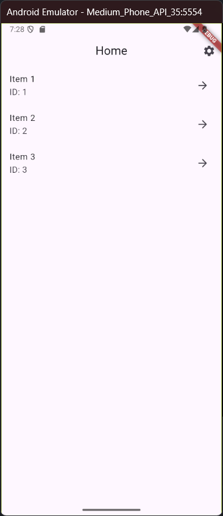
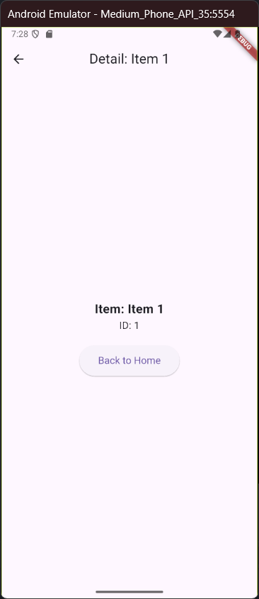
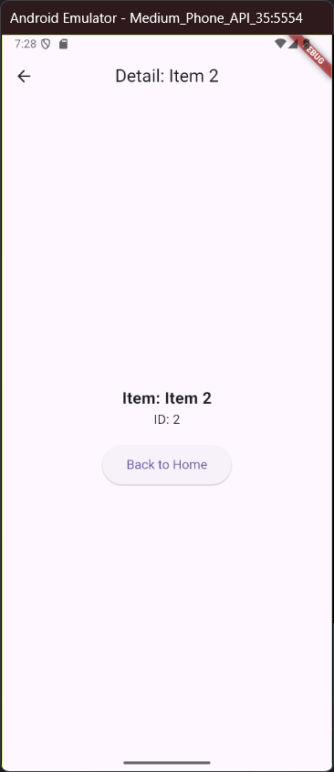
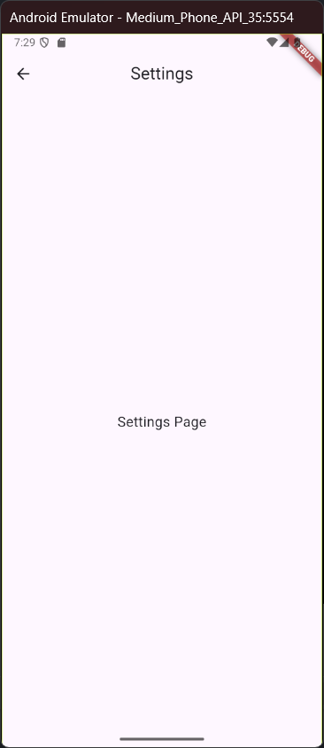

# Nama:
Jieo
# NPM:
4522210157

## Tujuan Praktikum
Praktikum ini bertujuan untuk memahami dan mengimplementasikan navigasi berbasis rute di Flutter menggunakan Navigator 2.0. Fokus praktikum ini adalah mengelola navigasi antar halaman secara deklaratif dan mendukung deep linking, di mana aplikasi dapat menavigasi antar halaman berdasarkan URL yang diterima.

## Deskripsi Aplikasi
Aplikasi ini adalah contoh implementasi deep linking dan navigasi berbasis rute menggunakan Flutter. Aplikasi ini memiliki tiga layar utama:
1. HomeScreen: Layar utama yang menampilkan daftar item.
2. DetailScreen: Layar yang menampilkan detail dari item yang dipilih, termasuk nama dan ID item.
3. SettingsScreen: Layar yang menampilkan halaman pengaturan aplikasi.
Aplikasi ini menggunakan Navigator 2.0 yang mengelola rute secara deklaratif, yang memungkinkan kita untuk menangani deep linking dan navigasi antar halaman berdasarkan status aplikasi.

## Screenshot Halaman

## Penjelasan Program
1. Item Class:
    - Item adalah kelas yang digunakan untuk mewakili item dengan atribut id dan name. Kelas ini digunakan untuk mengelola data item yang akan ditampilkan di layar utama dan detail.
2. RoutePath Class:
    - RoutePath mengelola konfigurasi rute untuk aplikasi. Ada tiga tipe rute yang dikelola:
        - Home: Menampilkan halaman utama.
        - Detail: Menampilkan halaman detail untuk item yang dipilih.
        - Settings: Menampilkan halaman pengaturan.
3. AppRouteInformationParser:
    - AppRouteInformationParser digunakan untuk mengonversi informasi rute menjadi objek RoutePath. Aplikasi ini dapat menangani rute seperti /, /detail/:id, dan /settings. Ini memungkinkan navigasi yang lebih fleksibel dan mendukung deep linking.
4. AppRouterDelegate:
    - AppRouterDelegate mengelola logika navigasi dengan menentukan halaman mana yang harus ditampilkan berdasarkan status aplikasi (misalnya, apakah halaman detail atau pengaturan sedang ditampilkan).
    - Fungsi navigasi utama di sini adalah selectItem, goHome, dan goToSettings, yang mengelola state aplikasi dan memicu perubahan layar.
5. HomeScreen, DetailScreen, and SettingsScreen:
    - HomeScreen: Menampilkan daftar item dan memungkinkan pengguna untuk memilih item atau pergi ke pengaturan.
    - DetailScreen: Menampilkan detail item yang dipilih dari daftar.
    - SettingsScreen: Menampilkan halaman pengaturan.

## Cara Menjalankan Program
flutter pub get
